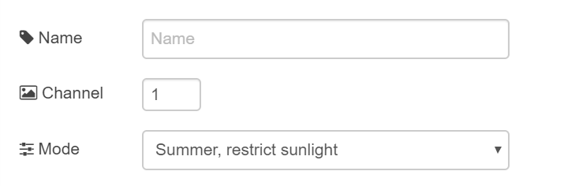
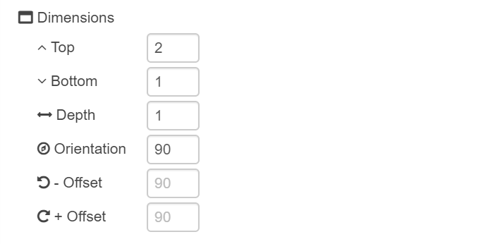
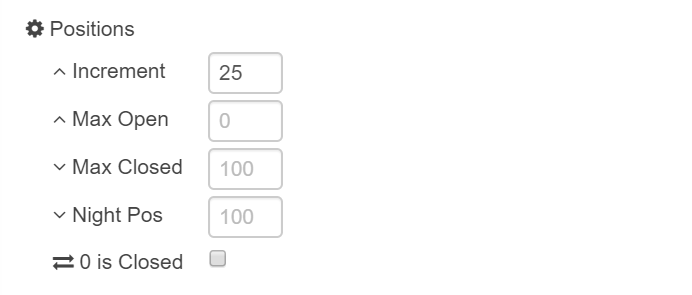
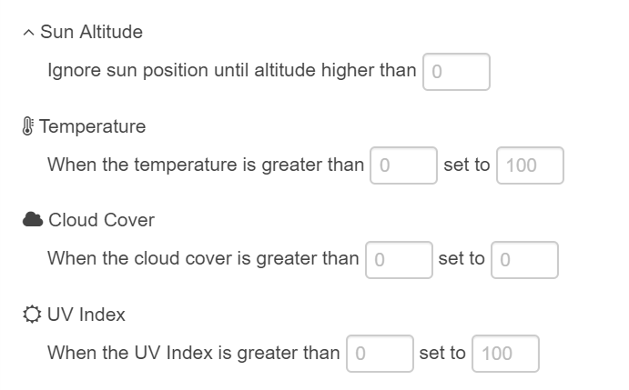
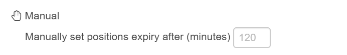
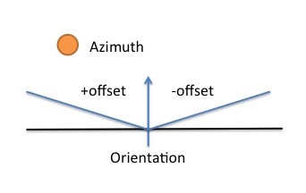
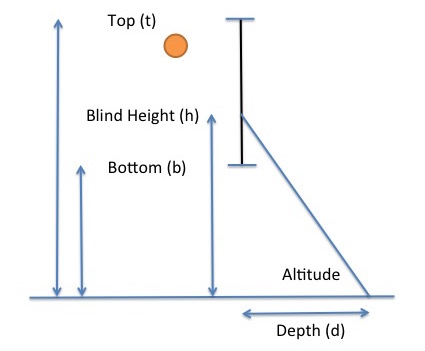
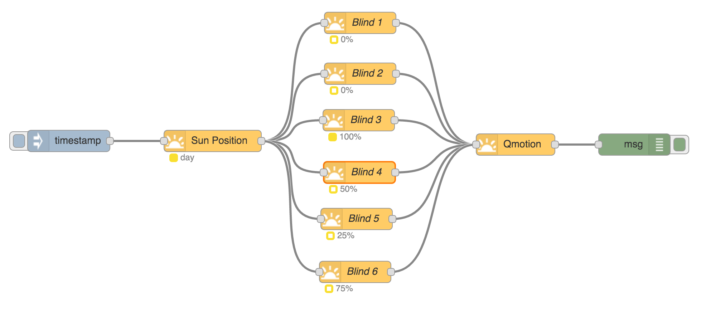
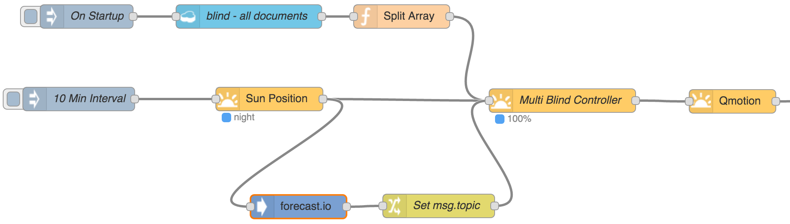

# node-red-contrib-blindcontroller

A collection of <a href="http://nodered.org" target="_new">Node-RED</a> nodes that automate the control of household roller blinds based on the current position of the sun.

## Install

Run the following command in the root directory of your Node-RED install

    npm install node-red-contrib-blindcontroller

<b>node-red-contrib-blindcontroller</b> is compatible with <b>node-red-contrib-sunpos</b>.

## Blind Controller

This node calculates the appropriate blind position to restrict or maximise direct sunlight through the associated window.

### Properties

* <b>channel</b>: identifier of the blind - which is used in the emitted <b>msg.payload</b>
* <b>mode</b>: mode of control
  * <b>Summer</b>: constrains the extent to which direct sunlight is allowed to enter the room
  * <b>Winter</b>: maximises the amount of direct sunlight allowed to enter the room

* <b>top</b>: measurement from the floor to top of the window covered by the blind
* <b>bottom</b>: measurement from the floor to bottom of the window covered by the blind
* <b>depth</b>: (optional) the extent to which direct sunlight is to be allowed into the room through the window, defined as a length on the floor. (Only relevant in Summer mode.)
* <b>orientation</b>: the bearing representing the perpendicular of the window to geographical north
* <b>negative offset</b>: (optional) anti-clockwise offset from orientation for determination of whether the sun is coming through window. Offsets allow for obstacles that inhibit direct sunlight through the window. The obstacle could be a tree, a wall, anything.
* <b>positive offset</b>: (optional) clockwise offset from orientation for determination of whether the sun is coming through window

* <b>increment</b>: the degree to which the blind position can be controlled
* <b>max open</b>: (optional) the maximum extent the blind is allowed to be opened during daylight hours. Defaults to 0.
* <b>max closed</b>: (optional) the maximum extent the blind is allowed to be closed during daylight hours. Defaults to 100.
* <b>night position</b>: (optional) the position of the blind outside of daylight hours. Defaults to 100.
* <b>0 is Closed</b>: (optional) checkbox to indicate the blind uses 0% to indicate the blind is closed rather than open.  Defaults to false

* <b>sun altitude threshold</b>: (optional) minimum altitude of the sun for determination of blind position
* <b>temperature threshold</b>: (optional) temperature at which the blind will be set to the <b>temperature threshold position</b> while the sun is in the window. This setting overrides <b>sun altitude threshold</b> and <b>depth</b> in the calculation
* <b>temperature threshold position</b>: (optional) the blind position associated with <b>temperature threshold</b>, default is fully closed
* <b>cloud cover threshold</b>: (optional) maximum percentage of sky occluded by clouds for the calculation to be performed
* <b>cloud cover threshold position</b>: (optional) the blind position associated with the <b>clouds threshold</b>, default is fully open
* <b>uv index threshold</b>: (optional) maximum uv index for the calculation to be performed
* <b>uv index threshold position</b>: (optional) the blind position associated with the <b>uv index threshold</b>, default to fully closed

* <b>expiry period</b>: (optional) the duration in minutes a manual setting will remain is place. Default to 120.

### Calculation
The calculation requires the output of the <a href="https://www.npmjs.com/package/node-red-contrib-sunpos" target="_new">Sun Position</a> Node. This can be supplemented with current weather conditions, such as that from forecastio or weather underground. <b>msg.topic</b> should be set to weather, and <b>msg.payload</b> either or both of the following properties:

* <b>maxtemp</b>: the forecasted maximum temperature for the day;
* <b>clouds</b>: A numerical value between 0 and 1 (inclusive) representing the percentage of sky occluded by clouds. A value of 0 corresponds to clear sky, 0.4 to scattered clouds, 0.75 to broken cloud cover, and 1 to completely overcast skies.
* <b>uvindex</b>: the current uv index

In Summer mode, the node calculates the appropriate blind position to restrict the amount of direct sunlight entering the room. This calculation includes:

* determination of whether direct sunlight is entering the room based on the orientation of the blind and the azimuth of the sun - taking into account the negative and positive offset properties; and

  
* dimensions of the window and the current altitude of the sun.  The node is agnostic of unit of measure, though the same UOM should be used for all dimensions.

  
* consideration of weather conditions against defined thresholds.  As per window dimensions, weather conditions are also agnostic of unit of measure and used consistently.

In Winter mode, the node calculates the appropriate blind position to maximise the amount of direct sunlight entering the room. This calculation is based on whether direct sunlight is entering the room based on the orientation of the blind and the azimuth of the sun - taking into account the negative and positive offset properties. When the sun is in the window the blind will positioned in the <b>max open</b> setting, otherwise it will be positioned in the <b>max closed</b> setting. In overcast conditions the blind will be positioned in the <b>max closed</b> setting.

The mode can be changed via a message. <b>msg.topic</b> should be set to mode, and <b>msg.payload</b> with the following property:

* <b>mode</b>: Set to either Summer or Winter

### Output
In the event the node determines a blind position change is required, it will emit a <b>msg.payload</b> with the properties of the blind including:

* <b>blindPosition</b>: the new position of the blind
* <b>blindPositionReasonCode</b>: code of rationale of the new position
  * <b>01</b> - Manually set
  * <b>02</b> - Sun below horizon
  * <b>03</b> - Sun below altitude threshold
  * <b>04</b> - Sun not in window
  * <b>05</b> - Sun in window
  * <b>06</b> - Overcast conditions
  * <b>07</b> - Temperature forecast above threshold
  * <b>08</b> - Low UV Index
* <b>blindPositionReasonDesc</b>: description of rationale of the new position (as above)

In addition, <b>msg.data</b> includes information useful for monitoring:

* <b>altitude</b>: altitude of the sun in degrees
* <b>azimuth</b>: azimuth of the sun in degrees
* <b>sunInWindow</b>: boolean value indicating whether direct sunlight is entering the room based on the orientation of the blind and the azimuth of the sun - taking into account the negative and positive offset properties

<b>msg.topic</b> is set to "blind".

### Manual Override
The node also supports manual overrides by processing messages with <b>msg.topic</b> set to blindPosition, and <b>msg.payload</b> containing the following properties:

* <b>channel</b>: the channel of the blind
* <b>blindPosition</b>: the new position of the blind
* <b>expiryperiod</b>: (optional) the duration in minutes this manual setting will remain is place.

Manual positions can be forced to expire by processing a message with <b>msg.topic</b> set to blindPositionReset, and <b>msg.payload</b> containing the following properties:

* <b>channel</b>: the channel of the blind
* <b>reset</b>: boolean indicating manual setting is to be reset

### Status
The node also reports its status within the Node-RED flow editor:

* colour indicates whether it is currently considered daylight hours;
* shape indicates whether the blind is fully closed or not;
* text reports current blind position.

## Multi Blind Controller

This node calculates the appropriate blind position to restrict direct sunlight through a number of windows. This node processes three types of input messages:

* blind configuration where <b>msg.topic</b> equals blind, and <b>msg.payload</b> contains the following properties:
  * channel
  * mode
  * orientation
  * noffset (optional)
  * poffset (optional)
  * top
  * bottom
  * depth
  * altitudethreshold (optional)
  * increment
  * maxopen (optional)
  * maxclosed (optional)
  * temperaturethreshold (optional)
  * temperatrurethresholdposition (optional)
  * cloudsthreshold (optional)
  * cloudsthresholdposition (optional)
  * uvindexthreshold (optional)
  * uvindexthresholdposition (optional)
  * nightposition (optional)
  * expiryperiod (optional)
  * opposite (optional)
* the output of the <a href="https://www.npmjs.com/package/node-red-contrib-sunpos" target="_new">Sun Position</a> Node;
* current weather conditions, such as that from forecastio or weather underground. <b>msg.topic</b> should be set to weather, and <b>msg.payload</b> either or both of the following properties:
  * maxtemp
  * clouds
  * uvindex
* a specified blind position (<b>msg.topic</b> set to blindPosition), which will remain in effect for the expiry period
  * channel
  * blindPosition
  * expiryperiod (optional)
* reset blind Position (<b>msg.topic</b> set to blindPosition)
  * channel
  * reset
* change mode for all blinds. <b>msg.topic</b> should be set to mode, and <b>msg.payload</b> with the following property:
  * <b>mode</b>: Set to either Summer or Winter

When processing either a Sun Position, Weather or Mode message, the blind position calculation is performed for each blind for which a configuration message has previously been received. Emitted messages from this node have the same properties as those emitted from the <b>Blind Controller</b> node.

This node does not report status within the Node-RED flow editor.

## Sample Flow

The figure below represents a sample flow of <b>Blind Controller</b> node can be used to control 6 Qmotion blinds at the one geo location. The flow is initiated by an Injector node configured to run periodically.

The figure below represents a sample flow using the <b>Multi Blind Controller</b> node for the same use case, where the blind configuration is stored in a Cloudant database.

